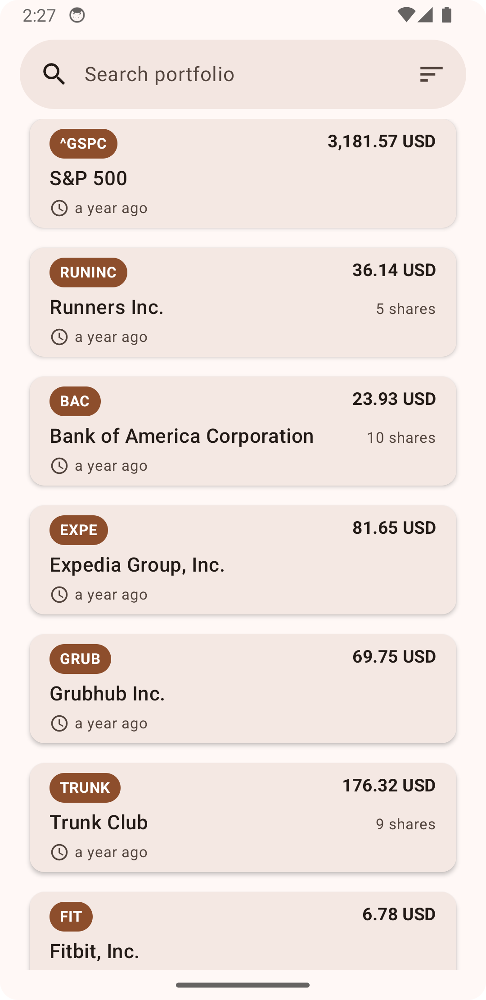
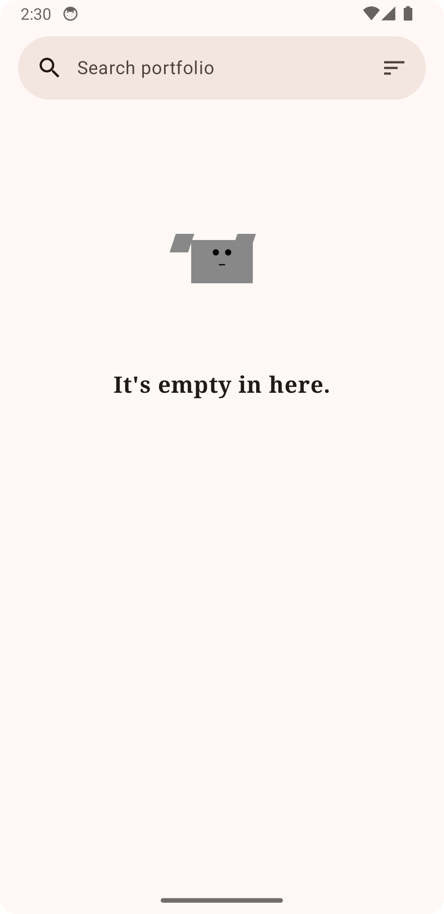
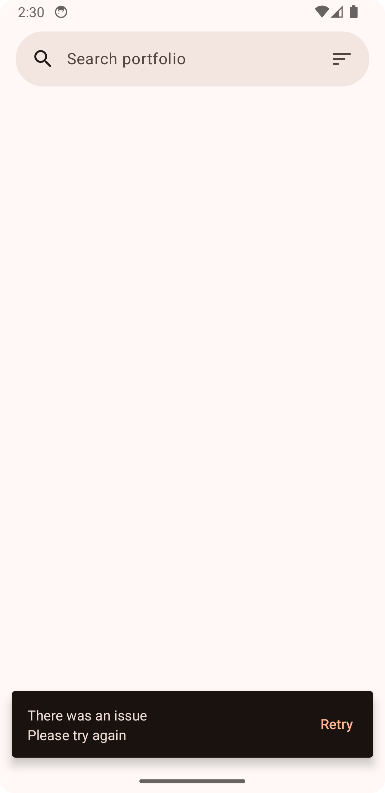
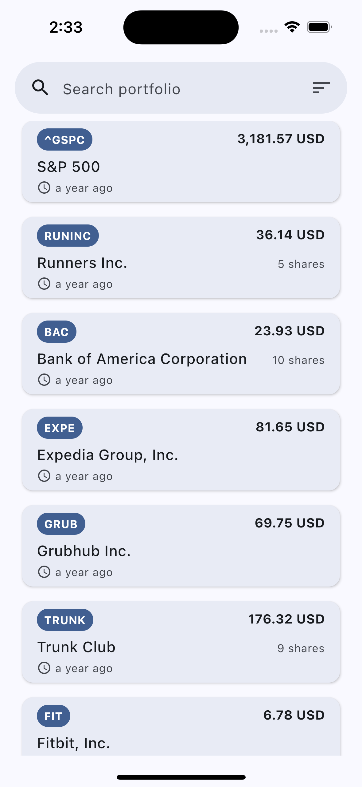
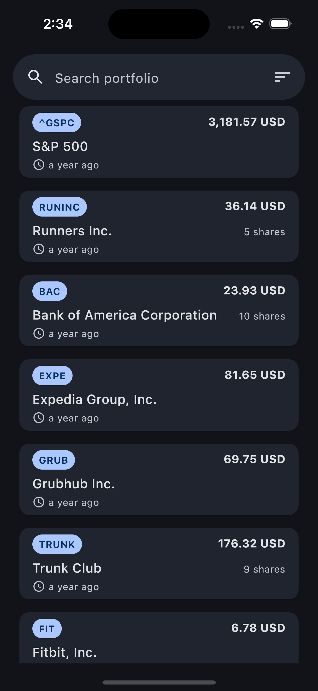
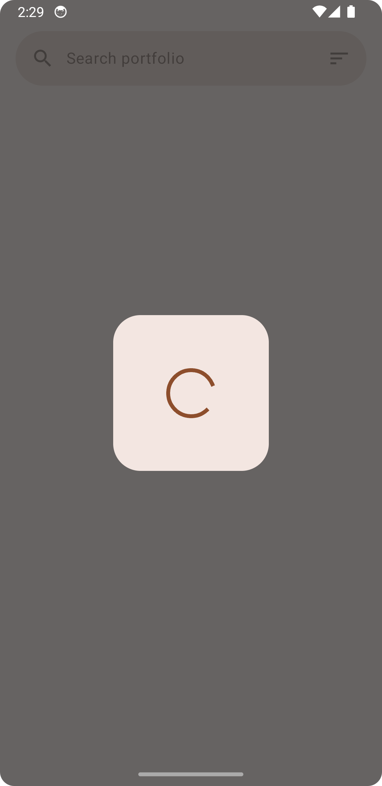

# Stocks Multiplatform Mobile App
This project, created as part of the application process for Cash App, showcases a simple yet effective mobile application that displays basic stock data across both iOS and Android platforms. Using Kotlin Multiplatform, the app leverages a shared codebase to present essential details about stocks, such as name, ticker, current price, currency, and quantity when available.

## Screenshots

### Android - Material You Theme

This screenshot displays the Android version of the app using the Material You design theme.

### Empty State

This screenshot shows the app's display when no stock data is available.

### Error State

This screenshot demonstrates the app's error state when data fails to load or an error occurs.

### iOS - Default Theme

This screenshot shows the iOS version of the app in the default theme.

### iOS - Night Mode Default Theme

This image displays the iOS version of the app using the default theme in night mode.

### Loading State

This screenshot illustrates the app's loading state as it fetches stock data.

## App Overview
The app fetches this data through a basic endpoint, focusing on straightforward data display without advanced tracking features or analytics. This approach not only demonstrates the potential of Kotlin Multiplatform for creating cross-platform applications but also serves as a practical example of handling and displaying financial data effectively in a mobile app environment.

Designed to be informative and accessible, this application is perfect for evaluating both the practical applications of Kotlin Multiplatform technology and my capabilities in software development.

## How to Run the Project

To get started with the Stocks project, you'll need Xcode 15 and Android Studio or JetBrains Fleet configured for Kotlin Multiplatform development. Follow the comprehensive setup instructions provided by JetBrains:
[Setting up Kotlin Multiplatform](https://www.jetbrains.com/help/kotlin-multiplatform-dev/multiplatform-setup.html).

Clone the repository:
```bash
git clone https://github.com/jassycliq/Stocks.git
```
After cloning, open the project in your preferred IDE and allow it to sync. There are two default run configurations provided—one for iOS and one for Android—that will build, install, and launch the app on the respective platforms.

## Focus Areas and Trade-offs

### Focus:
The architecture of the app was a major focus, balancing necessary abstractions for scalability with simplicity, as the app's functionality remains basic. This approach was chosen to ease future enhancements.

### Trade-offs:
The UI design is relatively basic due to limited data available from the endpoints. The use of Circuit for UI management simplified screen and presenter setups but posed challenges in accurately modeling various UI states. Ideally, an MVI pattern would be utilized to distinctly represent Loading, Error, and Success states; however, the complexity introduced by Circuit limited this implementation.

## Dependencies and Third-Party Libraries

The project's codebase is largely original, inspired by Chris Bane's Tivi app, particularly in terms of module setup, Gradle convention plugins, and iOS-specific Kotlin compiler flags.

## Project Duration

The project took about 5 hours focused on UI development. As this was an initial foray into Kotlin Multiplatform projects, additional time was spent on setup and learning, providing a robust learning experience and excitement for future developments with this technology.
